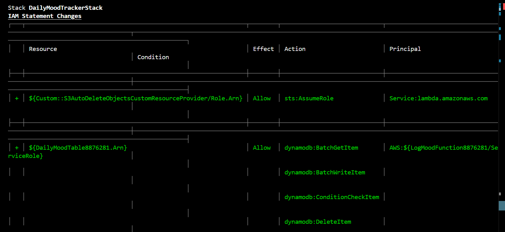

# Daily Mood Tracker (AWS CDK Project)

## Purpose

The **Daily Mood Tracker** is a cloud-native serverless application designed to collect and store users' mood logs using AWS services. It is built using the AWS CDK (Cloud Development Kit) and supports automated deployments via CodePipeline.

The goal of this project is to demonstrate infrastructure-as-code (IaC) principles, CI/CD automation, and the integration of Lambda, API Gateway, DynamoDB, and S3—all while ensuring reproducible cloud environments.

---

## Tech Stack

- **AWS CDK (Python)** – Infrastructure as Code
- **AWS Lambda** – Backend function for storing moods
- **Amazon DynamoDB** – NoSQL database to store mood entries
- **Amazon S3** – Storage for logs/assets
- **Amazon API Gateway** – Exposes the Lambda as a REST API
- **AWS CodePipeline** – CI/CD pipeline for automatic deployment
- **AWS CloudFormation** – Provisioning and managing stacks

---

## Setup Instructions

### Prerequisites

- AWS CLI configured
- Node.js (v20+ recommended)
- Python 3.10+
- AWS CDK installed:  
  ```bash
  npm install -g aws-cdk
  ```

---

## Commands Used

### 1. Install dependencies
```bash
pip install -r requirements.txt
```

### 2. Bootstrap CDK (once per environment)
```bash
cdk bootstrap aws://<ACCOUNT_ID>/<REGION>
```

### 3. Synthesize CloudFormation template
```bash
cdk synth
```

### 4. Deploy the stack
```bash
cdk deploy
```

### 5. Destroy the stack (if needed)
```bash
cdk destroy
```

---

## CodePipeline Setup

The project includes a `buildspec.yml` file to automate deployment using AWS CodePipeline. It watches the GitHub repo and automatically deploys changes to the stack.

---

## Known Issue

The Lambda function update fails during the CodePipeline deploy stage due to:

```
Resource handler returned message: "Error occurred while GetObject. 
S3 Error Code: NoSuchKey. S3 Error Message: The specified key does not exist."
```

**Root Cause**:  
The Lambda deployment artifact (ZIP file) expected by CloudFormation is not available in the S3 bucket at the time of update. This is typically due to CodePipeline not uploading the asset or a mismatch in the generated key during synth and deploy phases.

---

## Screenshots

### Architecture Diagram  


### CodePipeline Executed  


### Deployed CloudFormation Stack  


### Lambda Function  


### DynamoDB Table  


### S3 Bucket  


### GET Request Success  


### POST Request Success  


### DELETE Request Success  


### Stack Deployment Logs  


### IAM Role Permissions  


### CDK Synth Output  


### CDK Bootstrap Log  


### CDK Bootstrap Resources  


---

## Author

Student: **Jithin Jyothi**  
Student ID: **8876281**  
